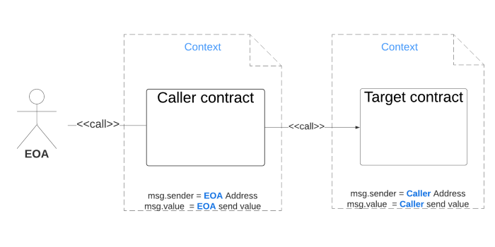
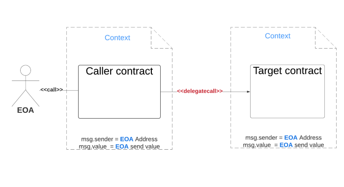

## start

```bash
npm install //安装依赖
npx hardhat node --network hardhat --no-deploy //启动本地节点
npx hardhat deploy //部署合约
```

示例代码来至 https://solidity-by-example.org/call

## call: 没有gas限制
会切换上下文，可以附加gas，value

 `address.call{value: 1ether}(“”) `功能等价 `transfer(1 ether)，` 但是没有 gas 限制

 失败不是发⽣异常，⼀定要检查返回值



## delegateCall
保持上下⽂,不⽀持附加value {value: } 

目标合约的值并未有发生改变，而调用者的值发生改变了，说明使用delegatecall调用，不改变作用域，相当于在A合约的函数作用域中执行，改变的是A合约的储存状态

proxy代理合约就是根据这个特点来的




## staticCall: 只读，不能修改目标函数中的数据


